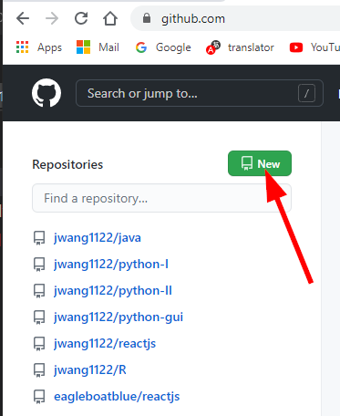

# Git Tricks

## push existing git repository
* Initial setup, make existing folder to be git repository;
```
git init
git config user.name <name>
git config user.email <email>
git remote add origin https://github.com/jwang1122/R.git
```
* Create remote repository
  
  
* Push existing repository to GitHub
```
git push --set-upstream origin master
```